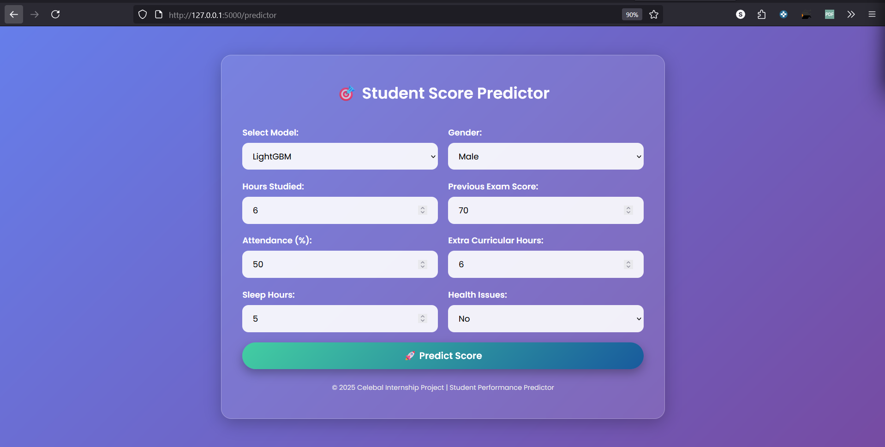
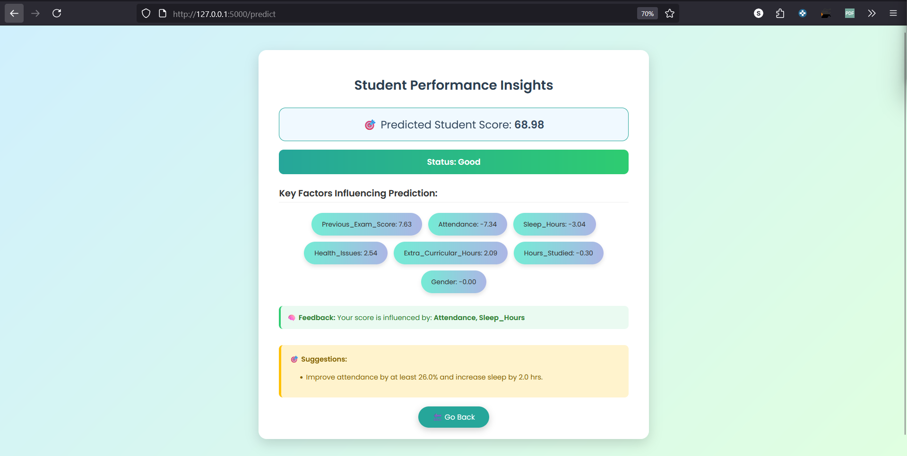

# 🎓 Student Score Predictor using Machine Learning

A smart, interactive web application that predicts a student's exam score based on multiple factors such as academic performance, attendance, study habits, sleep duration, and health conditions.

Built using **Flask** for the backend, the application is served in a production-ready environment using **Gunicorn** this project integrates powerful machine learning models like **LightGBM** and **XGBoost** to deliver accurate predictions. What sets it apart is the integration of **SHAP (SHapley Additive exPlanations)** — a model explainability tool that identifies the top factors influencing a student’s predicted score.

The app not only forecasts scores but also provides **personalized, data-driven suggestions** such as increasing study hours or improving attendance — helping students take actionable steps to boost their performance.

Ideal for educational institutions, tutors, or students seeking data-backed insights into academic improvement.

**🔗 Live Demo**

[Click here to try the model on Hugging Face 🚀](https://huggingface.co/spaces/souviksenapati/Student_Exam_Score_Prediction)


**📚 Table of Contents**

- [Key Technologies](#key-technologies)
- [Installation](#installation)
- [Usage](#usage)
- [Features](#features)
- [Screenshots](#screenshots)
- [Contributing](#contributing)
- [License](#license)
- [Contact](#contact)

---

**🛠️ Technologies Used**

- Python
- Gunicorn 
- Flask  
- Scikit-learn  
- LightGBM  
- XGBoost  
- SHAP(SHapley Additive exPlanations)
- jsPDF & html2canvas
- Pandas  
- NumPy
- pickle
- Git
- HTML/CSS/JS  

---
 
**⚙️ Installation**

Clone the repository and install the dependencies:

```bash
https://github.com/souviksenapati/Celebal-Summer-Internship-2025.git
cd Student_Exam_Score_Prediction
python -m venv venv
venv\Scripts\activate  # On Windows
pip install -r requirements.txt
python app.py
```
---

## 🚀 Usage

1. Open your browser and go to `http://127.0.0.1:5000`
2. Fill in student inputs:
   - Gender
   - Hours Studied
   - Previous Score
   - Attendance
   - Extra Curricular Hours
   - Sleep Hours
   - Health Issues
3. Choose ML Model:
   - LightGBM
   - XGBoost
4. Click **Predict** to:
   - View predicted score
   - Get SHAP-based key factor analysis
   - Receive personalized improvement suggestions
   - Download personalized prediction report as PDF

---

## ✨ Features

✅ Predicts student performance based on multiple factors  
✅ Two-model support: **LightGBM** and **XGBoost**  
✅ Models loaded using `pickle` (`.pkl`) files for fast inference   
✅ Real-time validation for total daily hours (24 hr cap)  
✅ SHAP explainability with top 2 negative factors  
✅ Personalized suggestions: "Increase study time by 2 hrs", etc.  
✅ Lightweight **Flask** backend served with **Gunicorn**, ideal for CPU-based deployment  
✅ Option to download personalized prediction report as PDF


---

## 📸 Screenshots

| Input Form | Prediction Result |
|------------|-------------------|
|  |  |


---

## 🤝 Contributing

Contributions are welcome! 🚀  
To contribute:

- Fork the repository  
- Create a new branch (`git checkout -b feature-xyz`)  
- Commit changes (`git commit -am 'Add new feature'`)  
- Push to the branch (`git push origin feature-xyz`)  
- Create a pull request  

---

## 📄 License

This project is licensed under the **MIT License**.  
See the [LICENSE](LICENSE) file for details.

---

## 📬 Contact

**Souvik Senapati**  
📧 Email: souviksenapati85@gmail.com  
🔗 LinkedIn: [linkedin.com/in/souviksenapati](https://linkedin.com/in/souviksenapati)


